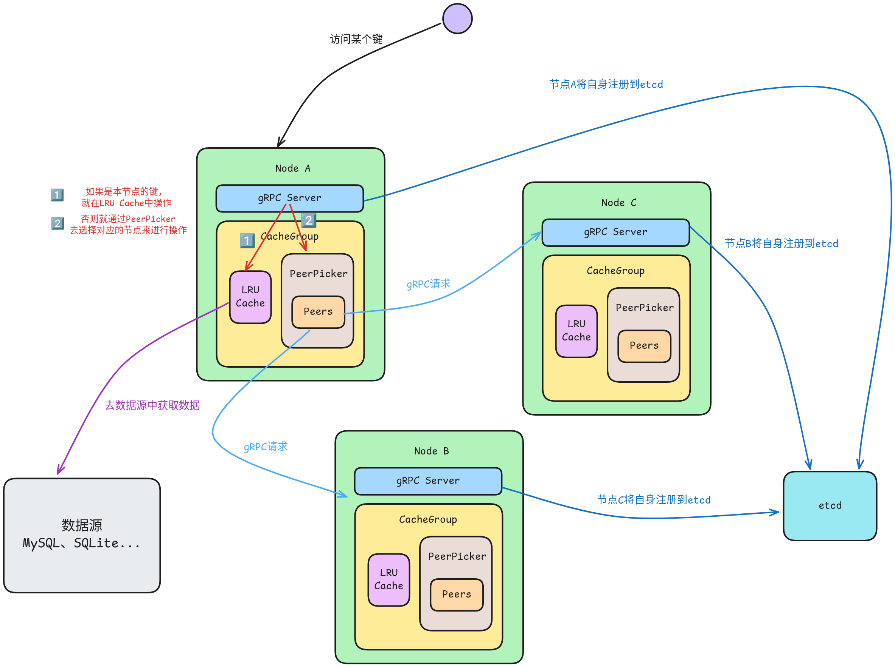

# KCache

[](https://deepwiki.com/kerolt/kcache)

KCache 是一个分布式缓存系统，基于一致性哈希算法实现数据分片，确保负载均衡，采用 LRU（最近最少使用）缓存淘汰算法；使用 gRPC 进行节点间高效通信，并基于 etcd 实现服务注册与发现，实时监控集群状态变化。该项目使用 conan 作为包管理工具，使用 CMake 作为项目的构建工具。

## 运行环境

- Ubuntu 22.04 (Docker)
- GCC 11.4 (use C++ 17)
- CMake 3.22.1
- Conan 2.16.1

## 项目依赖

- gflags / 2.2.2
- gtest / 1.16.0
- protobuf / 3.21.12
- grpc / 1.54.3
- etcd-cpp-apiv3 / 0.15.4
- fmt / 11.1.3
- spdlog / 1.15.1
- cpp-httplib / 0.20.1
- nlohmann_json / 3.12.0

该项目使用 [conan](https://conan.io/) 作为依赖管理工具，在配置该项目时需确保当前系统上安装了 conan。

> 项目 v2 版本不使用 vcpkg 了是因为其无法下载 etcd-cpp-apiv3，为了方便管理第三方库就只使用了 conan。

## 数据流程

当有客户端请求 kcache node 中的数据时：

1. 本地查找: 首先检查本地 LRU 缓存
2. 节点路由: 使用一致性哈希确定负责节点
3. 远程获取: 通过 gRPC 向目标节点请求数据
4. 数据源回退: 如果缓存未命中，从原始数据源加载
5. 缓存更新: 将数据存储到本地缓存以供后续使用

示意架构图如下：



## 致谢

1. 本项目参考了 [geektutu/7days-golang](https://github.com/geektutu/7days-golang) 项目，感谢其作者提供的 [教程](https://geektutu.com/post/geecache.html) 和代码示例。
2. 项目第二版参考了[【代码随想录知识星球】项目分享-缓存系统（Go）](https://github.com/youngyangyang04/KamaCache-Go)

## 项目结构

```
.
|-- .vscode
|   `-- launch.json
|-- example
|   |-- CMakeLists.txt
|   `-- example.cpp
|-- src
|   |-- cache
|   |   `-- lru.cpp
|   |-- consistent_hash
|   |   `-- consistent_hash.cpp
|   |-- group
|   |   `-- group.cpp
|   |-- include
|   |   `-- kcache
|   |       |-- cache.h
|   |       |-- consistent_hash.h
|   |       |-- group.h
|   |       |-- grpc_server.h
|   |       |-- peer.h
|   |       |-- registry.h
|   |       `-- singleflight.h
|   |-- peer
|   |   |-- peer.cpp
|   |   `-- peer_picker.cpp
|   |-- proto
|   |   |-- kcache.grpc.pb.cc
|   |   |-- kcache.grpc.pb.h
|   |   |-- kcache.pb.cc
|   |   |-- kcache.pb.h
|   |   `-- kcache.proto
|   |-- registry
|   |   `-- registry.cpp
|   |-- server
|   |   `-- grpc_server.cpp
|   |-- http_gateway.cpp
|   |-- node.cpp
|   `-- CMakeLists.txt
|-- test
|   |-- CMakeLists.txt
|   |-- test_consistent_hash.cpp
|   |-- test_group.cpp
|   `-- test_lru.cpp
|-- .clang-format
|-- .gitignore
|-- CMakeLists.txt
|-- CMakePresets.json
|-- conanfile.txt
|-- image.png
|-- LICENSE
`-- README.md
```

## 本地运行

项目中使用的第三方库 `etcd-cpp-apiv3` 中依赖的 `libsystemd/255`，而这个版本的 libsystemd 在高版本的 Linux Kernel 上有一个 bug：

```plain
Unknown filesystems defined in kernel headers:

Filesystem found in kernel header but not in filesystems-gperf.gperf: BCACHEFS_SUPER_MAGIC
Filesystem found in kernel header but not in filesystems-gperf.gperf: PID_FS_MAGIC
```

不过后面这个 bug 修复了，可以看[这里](https://lore.kernel.org/buildroot/ZmGjGvRCN3GwWFhp@landeda/T/)。而我们使用的 Conan 仓库中 etcd-cpp-apiv3 的最新版本还是依赖了 libsystemd/255。

因此如果继续使用 Conan 作为包管理器的话，就需要使用低版本的内核（6.8及以下），这里我使用的是 Ubuntu22.04，内核版本为 5.15，可以使用虚拟机或者 Docker。项目给出了 Dockerfile，能比较方便的构建出镜像，这里在下一章会有说明。

### 项目构建

1. 使用 conan 的 CMake 配置:

    在项目根目录下执行：

    ```sh
    conan install . --build=missing -s build_type=<Debug|Release>
    ```

    Debug 和 Release 取决于你的选择。

2. 配置项目：

    ```sh
    # cmake >= 3.23 
    cmake --preset conan-debug
    # cmake < 3.23
    cmake -DCMAKE_TOOLCHAIN_FILE=build/Release/generators/conan_toolchain.cmake -DCMAKE_BUILD_TYPE=Debug -S . -B build -G Ninja
    ```

    可按照你的需求将命令中的 debug(Debug) 换成 release(Release)

3. 构建项目：

    ```sh
    cmake --build build [--target <target>]
    ```

完成后，在 `src/proto` 目录下会生成 `src/proto/kcache.proto` 相关的 pb 和 grpc 文件：

- kcache.grpc.pb.cc
- kcache.grpc.pb.h
- kcache.pb.cc
- kcache.pb.h

在 build/bin 目录下会生成可执行程序，其中

- `knode` 为节点实例
- `kgateway` 为网关服务器

### 启动 etcd

```sh
docker run -d --name etcd \ 
        -p 2379:2379 \
        quay.io/coreos/etcd:v3.5.0 \
        etcd --advertise-client-urls http://0.0.0.0:2379 \
        --listen-client-urls http://0.0.0.0:2379
```

### 运行

在不同终端启动：

```sh
./build/bin/knode --port=8001 --node=A
./build/bin/knode --port=8002 --node=B
./build/bin/knode --port=8003 --node=C

./build/bin/kgateway
```

## Docker 运行

### 构建镜像  

```sh
docker build -t kcache:latest .  
```

> PS：如果构建时间长或者失败，可以考虑使用本地网络和代理：  
> `docker build --network host --build-arg HTTP_PROXY=http://your-proxy:port --build-arg HTTPS_PROXY=http://your-proxy:port -t kcache:latest .`

构建镜像时需要安装依赖，编译第三方库，可以喝杯☕慢慢等待~

### 单节点运行  

**启动 etcd**： 

可以使用 Go 版本文档中 etcd 的启动方式：  

```sh
docker run -d --name etcd   
  -p 2379:2379   
  quay.io/coreos/etcd:v3.5.0   
  etcd --advertise-client-urls http://0.0.0.0:2379   
  --listen-client-urls http://0.0.0.0:2379  
```

也可以在自己电脑上安装 etcd 来启动。  

**启动一个 kcache node**：

```sh
docker run -d   
  --name kcache-node   
  -p 8001:8001   
  --network host   
  kcache:latest   
  /app/bin/knode --port=8001 --node=A
```

### 多节点集群  

使用 Docker Compose 一键启动集群：  

```sh
# 启动整个集群（包含 etcd + 3个节点 + 网关）  
docker compose up -d  
```

可以通过 ps 查看服务状态， log 命令查看节点和网关的日志：  

```sh
# 查看服务状态  
docker compose ps  

# 查看日志  
docker compose logs -f  
```

结束任务，删除容器：  

```sh
# 停止服务  
docker compose down  
```

## 使用 curl 访问服务  

启动服务后，可以通过本机的 9000 端口来访问服务：  

1. Get  

```sh
curl http://127.0.0.1:9000/api/cache/test/Kerolt  
# 输出：{"group":"test","key":"Kerolt","value":"370"}⏎  
```

2. Set  

```sh
$ curl -X POST http://127.0.0.1:9000/api/cache/test/Kerolt -d 'value=1219'     
# 输出：{"group":"test","key":"Kerolt","success":true,"value":"value=1219"}⏎  
```

3. Delete

```sh
$ curl -X DELETE http://localhost:9000/api/cache/test/Kerolt  
# 输出：{"deleted":true,"group":"test","key":"Kerolt"}⏎  
```

## 核心组件

### LRU Cache 本地缓存

`Cache` 组件管理本地存储的缓存数据，底层采用 LRU 算法

- 提供线程安全的缓存访问
- 管理统计信息（命中、未命中）

### Group 缓存组

`Group` 是缓存的逻辑命名空间，**是缓存操作的主要接口**。外部可通过 rpc 来使用缓存节点，Group 会去执行对应的操作。

主要职责：

- 管理缓存数据的逻辑命名空间
- 协调本地缓存和远程节点之间的访问
- 处理缓存操作（Get、Set、Delete）
- 使用 singleflight 模式防止缓存击穿

### 一致性哈希

使用一致性哈希确定哪个节点负责哪个键，确保键值的均匀分布，并在添加或移除节点时最小化重新分布。

### PeerPicker 节点选择器

节点管理系统使节点能够相互通信，使用一致性哈希分布键值，并监听 etcd 的键值对变化。

### gRPC Server

每个节点都会跑一个 gRPC server，每个节点既是一个客户端也是服务端。

- 处理其他节点的请求（其他节点在没有缓存某些键的时候会访问含有这个键的节点）
- 向服务注册中心（etcd）注册自己
- 管理服务器生命周期

### 服务注册与发现

项目使用 etcd 进行服务发现。每个节点启动时向 etcd 注册自己（通过 gRPC Server），同时节点通过监听 etcd 变化发现可用的 peer 节点。

### 网关服务

HTTP 网关通过 etcd 自动发现可用的缓存节点，并通过 gRPC 与它们通信，为外部客户端提供标准的REST API接口

## 许可证

该项目使用 MIT 许可证，详情见 [LICENSE](LICENSE) 文件。
